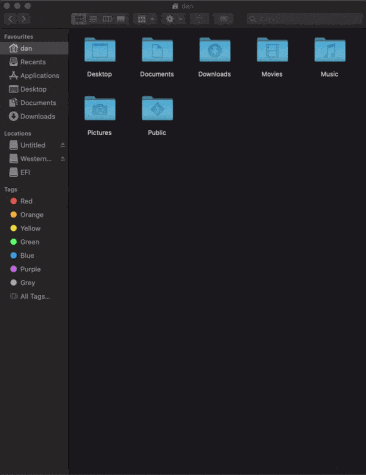

# AirPlonk

Uses [nmap] and [rsync] to quickly identify nodes and push files to them over port 22.

### Table of conents:

- [How To Use](#How-To-Use)
- [How To Install](#How-To-Install)
- [Help](#Help)
- [Contributing](#Contributing)
- [License](#License)
- [Author Info](#Author-Info)

## Demo

 &nbsp;&nbsp;  

## Installing

### Debian (Mint, Ubuntu, Kali ...)
Download this .deb package, then in the enclosing directory:
  ```
  sudo dpkg -i airplonk_1.0.3_all.deb
  ```

### Homebrew
```
brew tap daaanstraight/airplonk
brew install airplonk
```

### macOS
```
git clone https://github.com/daaanstraight/AirPlonk
cd AirPlonk
./install_macOS.sh
```
The install_macos.sh script will take care of putting files where they need to 
be, but you'll need to install the project dependencies on your own. AirPlonk 
will however list these for you should it detect any.

### Android-Termux 
```
git clone https://github.com/daaanstraight/AirPlonk
cd AirPlonk
./install_termux.sh
```
The install_termux.sh script will take care of installing the necessary 
dependencies.<br/>
Note: Use 'bash airplonk' to run if you don't have root permission.

### Otherwise
Clone this project, the 'airplonk' file contains all the neccesarry logic 
and the man page is in doc/airplonk.1 - move them where you need them.

## Help


## Contributing


## License


## Author Info

[nmap]: https://github.com/nmap/nmap
[rsync]: https://github.com/WayneD/rsync
